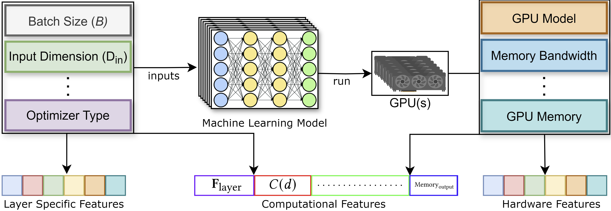

# DL Models Training Time Prediction

We have developed a framework that allows users to predict the training time of various deep learning models and architectures. This is achieved by gathering execution times of different deep learning layer types under diverse configurations.

After collecting this data which is shown in the following figure, we trained and evaluated multiple machine learning models for the regression task of predicting training times for individual layers. The best-performing model for each layer type was selected and is now used to provide accurate predictions of training times. This approach helps users estimate model performance and make informed decisions when designing or optimizing neural networks.




## Setup

To get started, follow the steps below:

1. Clone the repository:

```bash
git clone https://github.com/alirezaprl11/dl-training-time-prediction.git
cd dl-training-time-prediction
```

2. Create and activate a virtual environment:
```bash
python -m virtualenv venv
source ./venv/bin/activate
```

3. Install the required dependencies:
```bash
python -m pip install -r requirements.txt
```


## Training Data Generation
To gather training data for a specific GPU, navigate to the `data_collection` directory and run a benchmark. For example, to test RNN models, use the following command:

```bash
mkdir data
cd data_collection
python run.py --testRNN --num_val=20000 --repetitions=5 --log_dir=../data 
```

This command will run the benchmark for RNN models with 20,000 validation examples and repeat the process 5 times to gather data. The results will be saved in the `data` directory.
